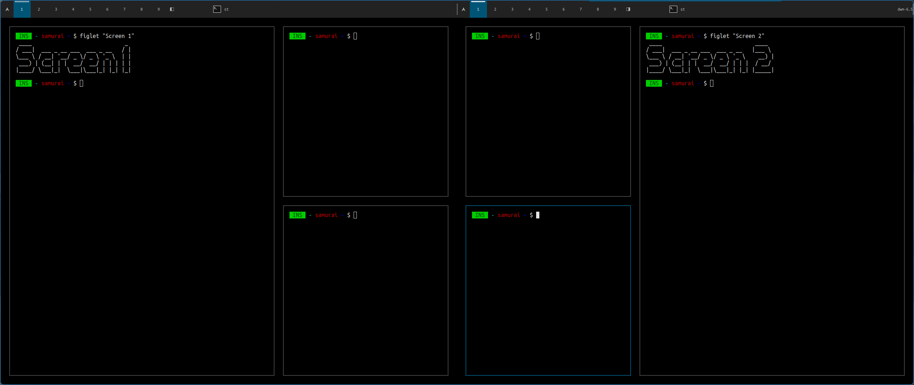
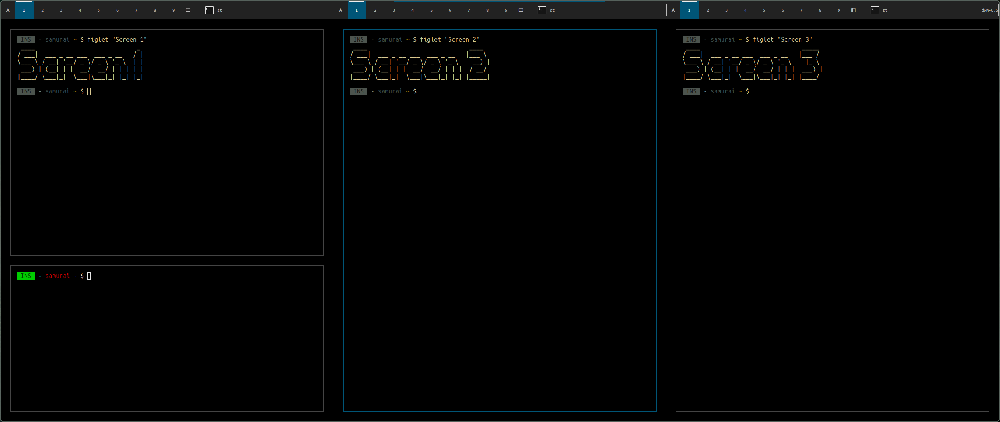
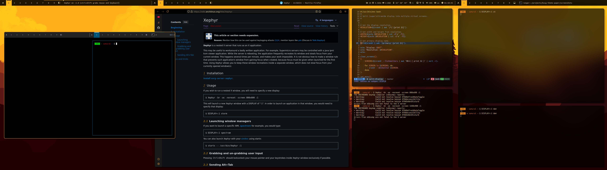

### dwm-virtual-mons-patch

This patch adds to dwm Xrandr support. So you can create virtual monitors.

This patch supports every combination of layouts you could imagine.

- **16:9** aspect ratio
- **21:9** aspect ratio
- **32:9** aspect ratio
- vertical displays

Also here is the bash script `virtual-mons` included, that helps to manage layouts.

It uses `dmenu` if it has launched without arguments or `layout_name` as a first argument.

To list all modes use:
```
virtual-mons -h
```

---
#### Layouts
##### Dual monitors


##### Triple monitors


##### Middle - My super ultrawide setup for example


---
#### Installation
1. Just apply patch to dwm
```
git apply dwm-xrandr-6.5.diff
```
2. Put a `virtual-mons` script to your `$PATH`

